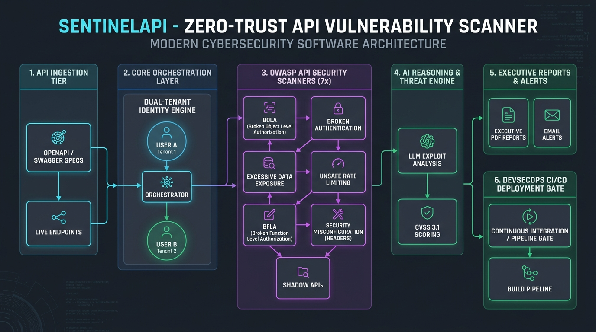
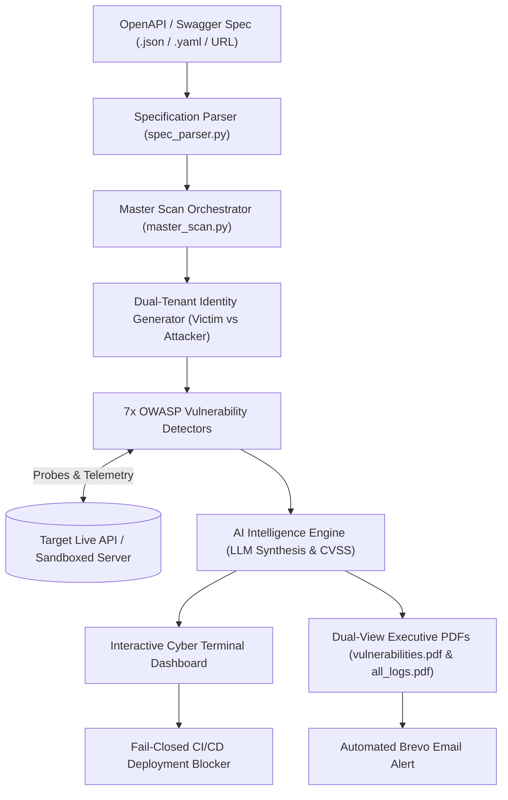

<p align="center">
  
</p>

<h1 align="center">🛡️ SentinelAPI</h1>

<p align="center">
  <b>AI-Powered Zero-Trust API Security Testing & Pentesting Engine</b><br/>
  <i>"Find the API vulnerability before the breach headline does."</i>
</p>

<p align="center">
  
  
  
  
  
</p>

---

## ⚡ Overview

**SentinelAPI** is an autonomous, terminal-first DevSecOps security engine that ingests OpenAPI 3.x and Swagger 2.0 specifications, models an API's attack surface, simulates dual-tenant (Attacker vs. Victim) exploit scenarios, and probes for critical business-logic vulnerabilities across **7 OWASP API Security Categories**.

Equipped with an integrated **AI Reasoning Engine**, **Dual-View Executive PDF Generator**, and **Automated Brevo Email Dispatch**, SentinelAPI bridges the gap between high-speed agile deployments and rigorous AppSec audits.

---

## 🚀 Key Highlights & Capabilities

- 🔓 **OWASP API1:2023 — BOLA / IDOR Testing:** Automatically discovers object parameters (`{userId}`, `{orderId}`) and executes cross-tenant access probes between simulated victim and attacker identities.
- 🔑 **OWASP API2:2023 — Authentication Misconfigurations:** Probes 7 attack vectors including missing headers, empty bearer tokens, `alg: none` JWT signature bypass, and cryptographic signature tampering.
- 📡 **OWASP API3:2023 — Excessive Data Exposure:** Deep recursive JSON crawler matching 40+ sensitive PII patterns (passwords, tokens, SSNs, credit cards, Stripe live keys) + undocumented schema drift detection.
- ⏱ **OWASP API4:2023 — Rate Limiting & Resource Exhaustion:** High-speed concurrency bursts against sensitive routes (login, OTP, search) to validate HTTP 429 throttling and `Retry-After` headers.
- 👑 **OWASP API5:2023 — BFLA & Privilege Escalation:** Probes administrative endpoints (`/admin`, `/roles`) using low-privilege member tokens; tests HTTP Verb Tampering (`DELETE`) and role injection.
- 🛡 **OWASP API8:2023 — Security Misconfigurations:** Audits missing defensive headers (HSTS, CSP, nosniff, Clickjacking), server banner leaks (`X-Powered-By`), permissive CORS wildcards with credentials, and insecure cookie flags (`HttpOnly`, `Secure`).
- 👻 **OWASP API9:2023 — Shadow & Zombie APIs:** Discovers undocumented legacy versions (`/v1` vs `/v2`), hidden beta export routes, exposed Spring Boot actuators (`/actuator/env`), and configuration leaks (`/.env`, `/.git`).
- 🧠 **AI-Powered Threat Reasoning:** Streams root-cause explanations, CVSS 3.1 risk scores, and copy-pasteable framework-specific code remediation blueprints.
- 📊 **Executive PDFs & Email Alerts:** Automatically compiles `vulnerabilities.pdf` (for leadership/devs) and `all_logs.pdf` (complete HTTP audit trail), then emails them via Brevo.
- 🛑 **Fail-Closed CI/CD Quality Gate:** Seamlessly halts GitHub Actions deployment workflows if critical vulnerabilities or probe failures are discovered (`Exit 0`: Clean Pass, `Exit 1`: Vuln Detected, `Exit 2`: Error).

---

## 🏗️ System Architecture



> 📖 **Full Architectural Dossier:** See [docs/ARCHITECTURE.md](docs/ARCHITECTURE.md) and the printable [docs/sentinel_architecture.pdf](docs/sentinel_architecture.pdf).

---

## 📂 Project Structure

```bash
SentinelAPI/
├── sentinelapi/
│   ├── api_source/          # OpenAPI/Swagger parser & route discovery
│   ├── cli/                 # Rich animations, cyberpunk themes & menus
│   ├── core/                # Typed data models (ScanResult, Finding, MasterScanResult)
│   ├── features/            # 7 OWASP Vulnerability Detectors
│   │   ├── Authentication_Misconfiguration/
│   │   ├── BFLA/
│   │   ├── Excessive_Data_Exposure/
│   │   ├── Rate_Limiting/
│   │   ├── Security_Misconfiguration/
│   │   ├── Shadow_Zombie_APIs/
│   │   ├── bola_idor/
│   │   └── master_scan.py   # Unified 7-module automated orchestrator
│   ├── modals/              # AI Intelligence engine & dynamic LLM connectors
│   ├── reporting/           # ReportLab PDF generator & Brevo automated email service
│   └── main.py              # CLI and CI/CD Entry Point
├── docs/
│   ├── ARCHITECTURE.md      # Detailed system architecture document
│   ├── PROBLEM_STATEMENT.md # AmiHacks 2026 Track C Hackathon brief
│   ├── sentinel_architecture.jpg # Architecture infographic
│   └── sentinel_architecture.pdf # High-resolution PDF version
├── markdown/                # Exported audit markdown reports
└── pyproject.toml           # Project dependencies & CLI entrypoints
```

---

## 🛠️ Quickstart & Usage

### 1. Installation
Clone the repository and install dependencies in editable mode:
```bash
git clone https://github.com/iblameyuvraj/SentinelAPI.git
cd SentinelAPI
pip install -e .
```

### 2. Environment Configuration
Copy the sample environment file and configure your API keys:
```bash
cp .env.example .env
```
Key configuration parameters in `.env`:
```env
# AI Engine Configuration (Gemini / OpenAI / Claude / Custom)
SENTINEL_AI_PROVIDER=custom
CUSTOM_LLM_BASE_URL=https://integrate.api.nvidia.com/v1
CUSTOM_LLM_API_KEY=your_api_key_here

# Automated Brevo Email Dispatch
BREVO_API_KEY=your_brevo_key_here
BREVO_SENDER_EMAIL=security@yourdomain.com
ALERT_RECIPIENT_EMAIL=lead-dev@yourdomain.com
```

### 3. Running SentinelAPI

#### 🎮 Interactive Mode (Cyberpunk Terminal UI):
```bash
sentinel
# or
python -m sentinelapi.main
```

#### 🤖 Headless / CI Pipeline Mode:
```bash
sentinel \
  --spec sandbox_openapi.json \
  --base-url https://api.staging.target.com \
  --token "eyJhbGciOi..." \
  --burst 20 \
  --ci
```

---

## 📊 Sample Output & Deliverables

Every automated audit generates publication-grade deliverables in the project root:

1. **`vulnerabilities.pdf`:** High-level executive risk score, OWASP compliance radar, and actionable code fixes for engineering leads.
2. **`all_logs.pdf`:** Comprehensive audit trail recording every HTTP method, URL, status code, latency (ms), and pass/fail telemetry.
3. **`markdown/*.md`:** Structured Markdown vulnerability dossiers for developer ticketing systems (Jira, GitHub Issues).
4. **Email Dispatch:** Live responsive HTML summary sent directly to the AppSec team with both PDFs attached.

---

## 📜 Documentation Links
- [Problem Statement & Hackathon Brief](docs/PROBLEM_STATEMENT.md)
- [System Architecture Specification](docs/ARCHITECTURE.md)
- [Architecture PDF Diagram](docs/sentinel_architecture.pdf)

---

<p align="center">
  <b>Built for AmiHacks 2026 • Track C (Deep-Tech)</b><br/>
  <i>Engineered with Python 3.11, Rich, ReportLab, Brevo API & LLM Reasoning</i>
</p>
