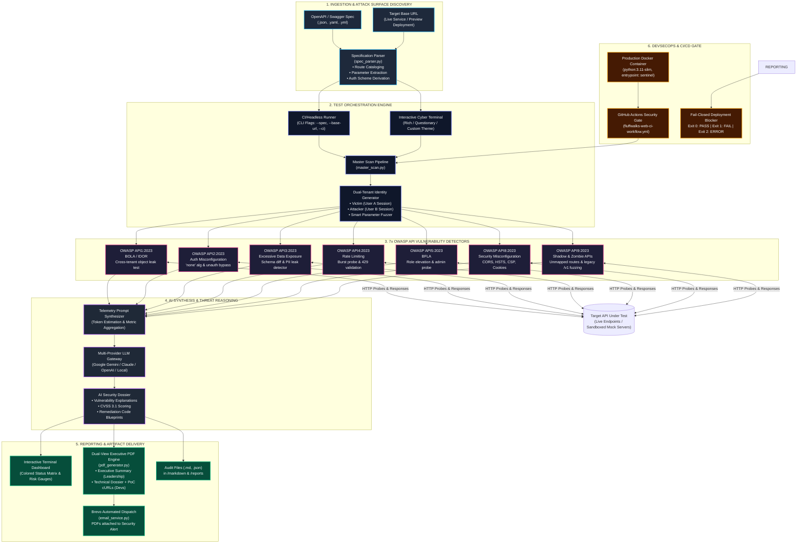
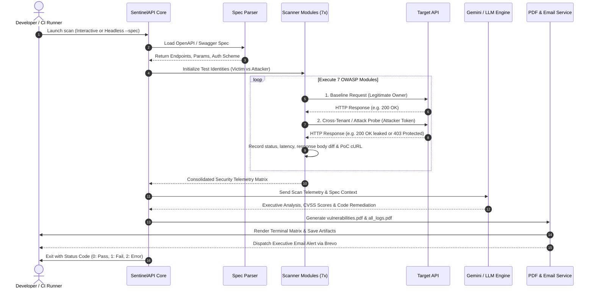

# SentinelAPI System Architecture

## Overview
**SentinelAPI** is an AI-powered, Zero-Trust API Vulnerability Scanner built for developers, AppSec teams, and automated CI/CD pipelines. It ingests OpenAPI/Swagger specifications, identifies attack surfaces, dynamically generates cross-tenant test scenarios across 7 OWASP API categories, leverages LLM reasoning for deep exploit analysis and remediation, and delivers executive PDFs and automated CI gates.

---

## High-Level Architecture Diagram

### Component Topology (Mermaid)

---

## End-to-End Execution Sequence Flow

---

## Core Architectural Components

### 1. Ingestion & Attack Surface Modeling
* **OpenAPI / Swagger Ingestion:** Parses OpenAPI 3.0 and Swagger 2.0 specifications in JSON or YAML format. Extracts route paths, methods, request bodies, query/path parameters, and authentication schemes.
* **Dynamic Parameter Mapping:** Identifies parameterized routes (e.g. `/users/{userId}/orders/{orderId}`) and infers parameter data types (UUID, integer, slug) to generate realistic test values.

### 2. Dual-Tenant Authorization Testing Engine
* **Cross-Tenant Probing:** Implements Zero-Trust validation by executing baseline queries with a legitimate resource owner's token (User A), followed by identical requests using an unprivileged or cross-tenant identity (User B).
* **Verdict Evaluation:** Differentiates between secured endpoints (401/403/404) and leaked boundaries (200 OK returning victim object data).

### 3. The 7 OWASP API Security Modules
1. **BOLA / IDOR (`bola_idor`):** Tests unauthorized access to object-level records across users.
2. **Authentication Misconfiguration (`Authentication_Misconfiguration`):** Tests missing auth, spoofed tokens, expired tokens, and `alg: none` JWTs.
3. **Excessive Data Exposure (`Excessive_Data_Exposure`):** Compares returned JSON payload keys against documented OpenAPI schema; flags leaked PII (passwords, tokens, SSNs, salary, internal keys).
4. **Rate Limiting (`Rate_Limiting`):** Sends high-concurrency bursts (10/20/30 reqs) and validates HTTP 429 throttling and retry headers.
5. **BFLA / Privilege Escalation (`BFLA`):** Probes administrative and privileged endpoints using low-privilege member/viewer credentials.
6. **Security Misconfiguration (`Security_Misconfiguration`):** Audits missing security headers (HSTS, CSP, CORS, X-Frame-Options) and insecure cookie attributes (`HttpOnly`, `SameSite`, `Secure`).
7. **Shadow & Zombie APIs (`Shadow_Zombie_APIs`):** Fuzzes undocumented legacy version prefixes (`/v1`, `/v2`, `/beta`, `/internal`) to uncover unmaintained endpoints.

### 4. AI Reasoning & Threat Synthesis
* Integrates with Google Gemini, Claude, OpenAI, and custom OpenAI-compatible local models.
* Generates technical dossiers explaining the business impact, calculated CVSS 3.1 vector, root-cause vulnerability analysis, and code-level remediation blueprints for engineers.

### 5. Multi-Stakeholder Reporting & Artifact Generation
* **Executive Summary:** High-level risk score, OWASP compliance radar, and total vulnerability count designed for CTOs and security managers.
* **Engineering Dossier:** Technical deep-dive with copy-pasteable, reproducible `curl` commands, request/response headers, and response payload diffs.
* **Automated Dispatch:** Built-in Brevo transactional email engine attaches PDF reports and delivers instant notifications to engineering teams.

### 6. DevSecOps CI/CD Integration
* **Fail-Closed Gate:** Emits standard non-zero exit codes to block GitHub PR merges when critical vulnerabilities are found (`Exit 0`: Clean Pass, `Exit 1`: Vulnerabilities Detected, `Exit 2`: Unreachable Host / Target Error).
* **Vercel Preview Auto-Discovery:** Seamlessly discovers and polls dynamic preview deployment URLs before running the audit suite.
