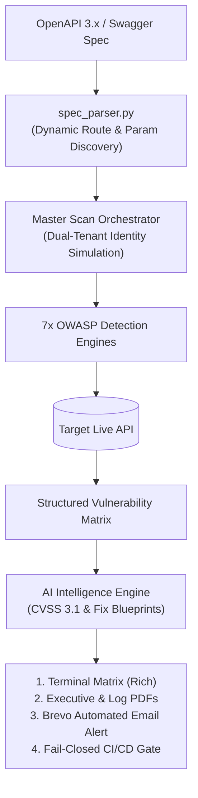

# AmiHacks 2026 — Track C (Industry / Deep-Tech)
# Problem Statement: SentinelAPI — Zero-Trust API Vulnerability Scanner

> *"Find the API vulnerability before the breach headline does."*

---

## 📌 Executive Summary

| Attribute | Details |
| :--- | :--- |
| **Event** | **AmiHacks 2026** |
| **Track** | **Track C — Industry / Deep-Tech** |
| **Project Title** | **SentinelAPI: Zero-Trust API Vulnerability Scanner** |
| **Domain** | API Security • DevSecOps • Zero-Trust Developer Tooling • Applied LLM Reasoning |
| **Target Audience** | Backend Engineers, Platform Teams, AppSec Specialists, Engineering Leadership |
| **Core Value** | Shift-Left Automated API Security Testing with Zero-False-Positive Proof-of-Concepts |

---

## 🚨 1. The Core Problem Statement

Modern cloud applications rely on dozens to hundreds of microservices, third-party integrations, and customer-facing APIs. **API-related security breaches**—specifically **Broken Object-Level Authorization (BOLA/IDOR)**, **Excessive Data Exposure**, **Broken Function-Level Authorization (BFLA)**, and **Security Misconfigurations**—have surged to become the #1 attack vector against production architectures.

Most engineering organizations, especially high-velocity startups and mid-size companies, possess **no automated, continuous mechanism** to audit their expanding API attack surface. Security reviews are conducted manually, infrequently (often quarterly or annually), and almost exclusively **after vulnerable endpoints are already active in production**.


### Who Suffers?
1. **Backend & Platform Engineers:** Own rapidly evolving endpoints with tight sprint deadlines; lack automated feedback loops for authorization logic.
2. **AppSec Teams:** Severely understaffed relative to the ballooning endpoint inventory; bogged down by repetitive manual penetration tests.
3. **End Users & Enterprises:** Customers whose sensitive PII, authentication tokens, financial data, and private records are exposed without warning.

---

## 🔍 2. Market Pain Points & Existing Limitations

```
┌──────────────────────────────────────┐     ┌──────────────────────────────────────┐
│       ENTERPRISE API SAAS            │     │       GENERIC DAST SCANNERS          │
├──────────────────────────────────────┤     ├──────────────────────────────────────┤
│ ✖ $50k+ annual contract lock-in      │     │ ✖ Signature & regex based only       │
│ ✖ Heavy cloud proxy setup required   │     │ ✖ Misses business logic & BOLA/IDOR  │
│ ✖ Inaccessible to startups & devs    │     │ ✖ High noise ratio (false alarms)    │
└──────────────────────────────────────┘     └──────────────────────────────────────┘
                                  ▲
                                  │
          ┌───────────────────────────────────────────────┐
          │         THE CRITICAL SECURITY GAP             │
          │   "Syntactically valid HTTP 200 OK requests   │
          │    that silently leak another tenant's data"  │
          └───────────────────────────────────────────────┘
```

* **The Business-Logic Blindspot:** Detecting authorization flaws cannot be solved with legacy signature scanning. A request to `/api/v1/orders/502` by User `101` returns valid JSON with `HTTP 200 OK`. To traditional scanners, this looks like a healthy response; to an attacker, it is a catastrophic cross-tenant breach.
* **Lack of Actionable Triage:** Legacy tools dump unstructured raw JSON logs without reproducible reproduction commands or developer-ready code fixes.
* **Velocity Mismatch:** APIs deploy multiple times per day via CI/CD, while security audits occur months later.

---

## 🎯 3. Objective & Solution Vision

**SentinelAPI** is an AI-powered, terminal-first, zero-trust API vulnerability scanner. It ingests an OpenAPI/Swagger definition or live base URL, automatically discovers the endpoint topology, formulates targeted cross-tenant attack vectors across the **OWASP API Security Top 10 (2023)**, evaluates server responses with deterministic heuristics, and streams executive reports with concrete remediation blueprints.



---

## ⚡ 4. Expected Solution Capabilities & Features

### 🛡️ Coverage: 7 OWASP API Security Modules
| OWASP Category | Vulnerability Class | SentinelAPI Automated Probe Strategy |
| :--- | :--- | :--- |
| **API1:2023** | **BOLA / IDOR** | Dynamic path variable detection (`{userId}`, `{orderId}`); dual-token cross-tenant testing (Attacker token $\to$ Victim resource). |
| **API2:2023** | **Authentication Misconfig** | 7 mutation vectors: Missing auth, empty token, fake token, `alg: none` JWT bypass, tampered cryptographic signature, expired token, malformed syntax. |
| **API3:2023** | **Excessive Data Exposure** | Recursive JSON key crawler; checks 40+ sensitive PII patterns (passwords, JWTs, Stripe keys, SSNs, credit cards) + OpenAPI schema drift. |
| **API4:2023** | **Rate Limiting / DoS** | High-concurrency burst requests (default: 20 reqs); validates HTTP 429 throttling and `Retry-After` / `X-RateLimit-*` headers on sensitive endpoints. |
| **API5:2023** | **BFLA / Privilege Escalation** | Probes administrative routes (`/admin`, `/roles`) using low-privilege credentials; tests HTTP Verb Tampering (`DELETE`) and role injection (`role: admin`). |
| **API8:2023** | **Security Misconfigurations** | Audits HSTS, CSP, nosniff, X-Frame-Options, server banner fingerprinting (`X-Powered-By`), permissive CORS wildcards, and insecure cookie flags (`HttpOnly`, `Secure`). |
| **API9:2023** | **Shadow & Zombie APIs** | Route mutation fuzzing: deprecated version downgrades (`/v2` $\to$ `/v1`), unmapped beta endpoints, exposed Spring actuators (`/actuator/env`), and configuration leaks (`/.env`, `/.git`). |

### 🔬 Zero-Trust & Developer-Centric Capabilities
1. **Reproducible Proof-of-Concepts (PoCs):** Every confirmed vulnerability automatically produces a ready-to-paste `curl` command with exact headers and payloads.
2. **Dual-View Executive PDFs:**
   - **`vulnerabilities.pdf`:** High-level risk radar, executive summaries, CVSS severity breakdown, and developer remediation blueprints.
   - **`all_logs.pdf`:** Full engineering audit trail recording every HTTP method, URL, status code, latency (ms), and pass/fail telemetry.
3. **Automated Notification Engine:** Real-time publication-grade HTML security audit dispatch via **Brevo API** with generated PDFs directly attached.
4. **DevSecOps Fail-Closed CI Gate:** Integrates into GitHub Actions with clean exit codes (`Exit 0`: Pass, `Exit 1`: Vuln Found, `Exit 2`: Host Unreachable) to prevent insecure deployments.

---

## 💡 5. Innovation Opportunities Realized

* **Dynamic Schema Inference:** Automatically infers data types (Integer, UUID, Slugs) and generates smart parameter permutations without manual fuzzer dictionaries.
* **Context-Rich AI Reasoning:** Translates raw HTTP response telemetry into root-cause vulnerability explanations and concrete code fixes (Node.js/Express, Python/FastAPI).
* **Terminal-First Craftsmanship:** Built with Rich and Questionary for a responsive, cyberpunk-inspired developer experience complete with progress gauges and diagnostic tables.
* **Fail-Closed CI/CD Architecture:** Zero-touch headless execution that acts as a quality gate in modern deployment pipelines.

---

## ⚖️ 6. Constraints, Ethics & Safety Considerations

> [!CAUTION]
> **Ethical Boundary & Safety Mandate:**
> SentinelAPI is strictly designed to audit explicitly authorized, sandbox-configured, or self-hosted target APIs. Automated probes avoid destructive state corruption and focus on deterministic authorization boundary verification.

* **Minimizing False Positives:** Heuristics verify HTTP status codes, response structure diffs, and cryptographic validity to ensure engineers only spend time on genuine security defects.
* **Non-Destructive Execution:** Probes test object access and query logic safely without injecting payload corruption into backend persistent stores.
* **Zero Credential Exposure:** Temporary test tokens and environment keys are managed strictly in-memory or loaded securely via `.env`.

---

## 🏆 7. Hackathon Execution & Rubric Alignment

| Evaluation Criteria | Hackathon Expectation | SentinelAPI Implementation |
| :--- | :--- | :--- |
| **Problem Relevance** | Real-world API breach vector | Addresses OWASP Top 10 with direct relevance to modern microservices architectures. |
| **Technical Depth** | Beyond simple signature checks | Dual-identity cross-tenant simulation, cryptographic signature tampering, recursive JSON parsing. |
| **Completeness** | Working end-to-end flow | Ingestion $\to$ Probing $\to$ Live Telemetry $\to$ AI Synthesis $\to$ Dual PDFs $\to$ Email Alert $\to$ CI Gate. |
| **Developer Experience** | High-utility UI/UX | Rich interactive terminal, one-time configuration locking, automated prompt interception. |
| **Extensibility** | Production modularity | Clean modular architecture separating parsers, core models, feature detectors, and reporting drivers. |

---

<p align="center">
  <b>Built for AmiHacks 2026 • Track C (Deep-Tech)</b><br/>
  <i>Engineered with Python 3.11, Rich, ReportLab, Brevo API & LLM Reasoning</i>
</p>
